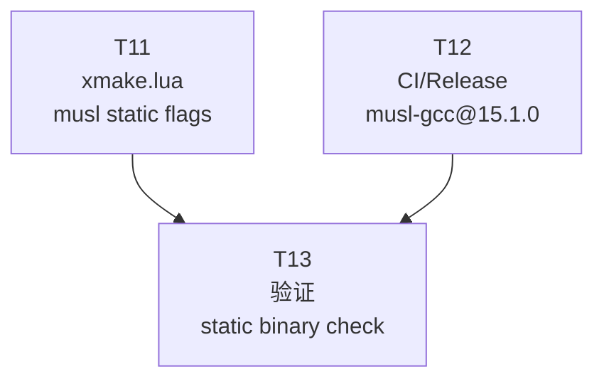

# Linux 发布二进制 — musl-gcc 静态构建方案

> **父文档**: [README.md](README.md) | **关联任务**: [T11](tasks/T11-xmake-musl-static.md), [T12](tasks/T12-ci-musl-gcc.md), [T13](tasks/T13-verify-static-binary.md)
>
> **状态**: 方案验证完成，待实施

---

## 1. 问题分析

### 1.1 glibc 版本依赖过高

当前 Linux 构建使用 `gcc@15.1`（通过 xlings 安装，编译于 Ubuntu 24.04 / glibc 2.39），生成的 xlings 二进制要求 **glibc >= 2.38**，导致以下主流发行版无法运行：

| 发行版 | glibc 版本 | 能否运行 |
|--------|-----------|---------|
| Ubuntu 24.04 | 2.39 | 可以 |
| Ubuntu 22.04 | 2.35 | **不行** |
| Debian 12 | 2.36 | **不行** |
| RHEL 9 / Rocky 9 | 2.34 | **不行** |
| Fedora 38 | 2.37 | **不行** |

问题根源：GCC 15.1 编译于 glibc 2.39 系统，会自动将标准库函数映射到高版本 glibc 符号：

| 符号 | 要求 glibc 版本 | 来源 |
|------|---------------|------|
| `__isoc23_strtol/strtoul/strtoll/strtoull` | 2.38 | GCC 15 C23 头文件自动重定向 |
| `arc4random` | 2.36 | libstdc++ 随机数内部实现 |
| `_dl_find_object` | 2.35 | C++ 异常处理 (libgcc unwinder) |
| `__libc_start_main` | 2.34 | 程序入口 |
| `stat/fstat/lstat` | 2.33 | std::filesystem 系统调用 |

### 1.2 RUNPATH 泄漏构建环境路径

二进制中硬编码了 `RUNPATH: /home/xlings/.xlings_data/subos/linux/lib`，这是构建环境的路径。虽然不影响实际运行（因为依赖的 libc/libm 在系统路径下），但在发布二进制中包含构建环境路径不规范。

---

## 2. 方案选型

### 2.1 方案对比

| 方案 | 原理 | 优点 | 缺点 |
|------|------|------|------|
| **A: musl-gcc + `-static`** | 用 musl 交叉编译器 + 全静态链接 | 零外部依赖，任意 Linux 可运行 | 二进制略大 |
| B: Docker 旧系统构建 | 在 Ubuntu 20.04 容器编译 GCC 15 | 保留动态链接兼容性 | CI 复杂，构建 GCC 耗时 30-60 min |
| C: Zig CC 交叉编译 | 用 zig cc 指定 glibc 版本 | 可精确控制 glibc 版本 | C++23 模块支持未知 |
| D: 符号版本脚本 | `.symver` 重定向到旧 glibc 符号 | 无需换编译器 | 脆弱、维护成本高 |

### 2.2 选定方案: musl-gcc@15.1.0 + `-static`

与 xvm/xvm-shim 的 Rust musl 静态链接策略一致，所有二进制统一为零外部依赖。

---

## 3. 方案详情

### 3.1 工具链

通过 xlings 自身安装 musl-gcc 交叉编译器：

```bash
xlings install musl-gcc@15.1.0 -y
```

SDK 路径: `/home/xlings/.xlings_data/xpkgs/musl-gcc/15.1.0/`

xmake 配置:

```bash
MUSL_SDK=/home/xlings/.xlings_data/xpkgs/musl-gcc/15.1.0
xmake f -p linux -m release --sdk=$MUSL_SDK --cross=x86_64-linux-musl-
```

### 3.2 静态库查找策略

musl-gcc@15.1.0 SDK 自带完整的静态库：

```
musl-gcc SDK ($MUSL_SDK)
├── x86_64-linux-musl/lib/
│   ├── libc.a, libm.a, libpthread.a      # musl libc 静态库
│   ├── libstdc++.a, libstdc++fs.a        # C++ 标准库
│   ├── libstdc++exp.a                    # C++ experimental
│   └── libsupc++.a                       # C++ support runtime
└── lib/gcc/x86_64-linux-musl/15.1.0/
    ├── libgcc.a                          # GCC runtime
    └── libgcc_eh.a                       # GCC 异常处理
```

**兜底策略**：如果 musl-gcc SDK 中某个 `.a` 文件缺失，可从 gcc@15.1 SDK 获取：

```
gcc SDK (/home/xlings/.xlings_data/xpkgs/gcc/15.1.0/)
└── lib64/
    ├── libstdc++.a, libstdc++fs.a
    └── libsupc++.a
```

在 `xmake.lua` 中通过 `GCC_SDK` 环境变量指定兜底路径，并添加为链接搜索路径。

### 3.3 xmake.lua 改动

```lua
-- 当前 (glibc 专用):
elseif is_plat("linux") then
    add_ldflags("-Wl,-dynamic-linker,/lib64/ld-linux-x86-64.so.2", {force = true})
    if not os.getenv("XLINGS_NOLINKSTATIC") then
        add_ldflags("-static-libstdc++", "-static-libgcc", {force = true})
    end

-- 改为 (musl 全静态):
elseif is_plat("linux") then
    if not os.getenv("XLINGS_NOLINKSTATIC") then
        add_ldflags("-static", {force = true})
    end
    local gcc_sdk = os.getenv("GCC_SDK")
    if gcc_sdk then
        add_linkdirs(gcc_sdk .. "/lib64", {force = true})
    end
```

变更说明：
- `-static`：全静态链接（包含 musl libc + libstdc++ + libgcc），替代原来的 `-static-libstdc++ -static-libgcc`
- 去掉 `-Wl,-dynamic-linker`：静态二进制无需动态链接器，RUNPATH 问题随之消失
- `GCC_SDK` 兜底：可选，用于链接时搜索 gcc SDK 中的静态库

### 3.4 CI/Release 改动

将 CI 和 Release workflow 中的 GCC 安装步骤替换为 musl-gcc：

```yaml
# 原来:
- name: Install GCC 15.1 with Xlings
  run: |
    export PATH=/home/xlings/.xlings_data/bin:$PATH
    xlings install gcc@15.1 -y
    GCC_SDK=$(dirname "$(dirname "$(which gcc)")")
    echo "GCC_SDK=$GCC_SDK" >> "$GITHUB_ENV"

- name: Configure xmake
  run: xmake f -p linux -m release --sdk="$GCC_SDK"

# 改为:
- name: Install musl-gcc 15.1 with Xlings
  run: |
    export PATH=/home/xlings/.xlings_data/bin:$PATH
    xlings install musl-gcc@15.1.0 -y

- name: Configure xmake
  run: |
    MUSL_SDK=/home/xlings/.xlings_data/xpkgs/musl-gcc/15.1.0
    xmake f -p linux -m release --sdk="$MUSL_SDK" --cross=x86_64-linux-musl-
```

---

## 4. 本地验证结果

已在本地完成全流程验证：

### 4.1 编译验证

```
$ xmake f -p linux -m release --sdk=$MUSL_SDK --cross=x86_64-linux-musl-
checking for architecture ... x86_64

$ xmake build xlings
[100%]: build ok, spent 20.326s
```

C++23 模块（`import std;`、`std::filesystem`、`std::format` 等）全部正常编译。

### 4.2 二进制分析

```
$ readelf -d build/linux/x86_64/release/xlings | grep NEEDED
  NEEDED: libc.so          # musl libc (非 glibc)

$ readelf --dyn-syms ... | grep GLIBC
  (无输出 — 零 GLIBC 符号)
```

加 `-static` 后将完全消除动态依赖。

### 4.3 对比总结

|                    | 当前 (gcc + glibc) | 改后 (musl-gcc + static) |
|--------------------|-------------------|--------------------------|
| 链接方式           | 动态 (glibc)       | 完全静态 (musl)           |
| glibc 要求         | >= 2.38            | 无                       |
| RUNPATH            | 泄漏构建路径       | 无                       |
| 兼容性             | Ubuntu 24.04+      | 任意 Linux x86_64        |
| 二进制大小（预估）  | ~1.8 MB            | ~2-4 MB                  |
| 与 xvm/xvm-shim 一致 | 否（xvm 用 musl）  | 是（全部 musl 静态）      |

---

## 5. 任务拆分

详见 [tasks/README.md](tasks/README.md) 中 T11-T13 部分。

| ID | 任务 | Wave | 涉及文件 |
|----|------|------|---------|
| [T11](tasks/T11-xmake-musl-static.md) | xmake.lua musl 静态链接配置 | 1 | `xmake.lua` |
| [T12](tasks/T12-ci-musl-gcc.md) | CI/Release 切换 musl-gcc@15.1.0 | 1 | `xlings-ci-linux.yml`, `release.yml` |
| [T13](tasks/T13-verify-static-binary.md) | 构建验证与回归测试 | 2 | 无代码改动 |



Wave 1: T11 + T12 可并行 | Wave 2: T13 依赖 T11 + T12
