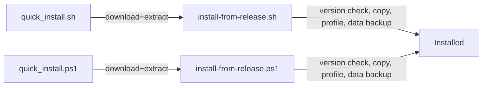
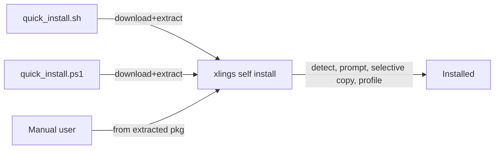

# 内化安装逻辑到 `xlings self install`

> 将 `install-from-release.sh` / `install-from-release.ps1` 的全部安装逻辑迁移到 xlings C++ 二进制中，通过 `xlings self install` 完成安装。仅保留薄的 quick install 脚本作为下载器。

## 设计变更 (2026-02)

**data/subos 保留策略**：原先采用「备份 → 全删 → 复制 → 恢复」，在本地已有 xlings 时升级可能导致 subos 损坏（`fs::copy` 对 symlink 处理不当）。现改为「直接不删除、选择性不覆盖」：安装时从不删除 data/subos；复制时若 target 已有 data/ 或 subos/ 则直接跳过（不合并任何内容）。subos 可有多个（default、s1、s2...），且 bin 等由 PATH 优先使用 bin/，故无需覆盖。release 包仍包含完整 data/subos 骨架，供首次安装使用。

## 迁移前架构



## 目标架构



## 关键设计决策

- `xlings self install` 从解压后的 release 包内运行（self-contained 模式），将自身安装到 `~/.xlings`（或检测到的已有安装位置）。
- 所有平台特定逻辑（shell profile、PATH、symlink/junction）通过现有 platform 模块模式在 C++ 中实现。
- `install-from-release.sh` 和 `install-from-release.ps1` 脚本**删除**；其逻辑迁移到 `core/xself.cppm`。
- 薄的 `quick_install.sh` / `quick_install.ps1` 脚本保留，但改为调用 `./bin/xlings self install` 而非 `bash install.sh` / `powershell install.ps1`。
- Release 打包脚本（`linux_release.sh`、`macos_release.sh`、`windows_release.ps1`）不再将 `install-from-release.*` 复制到包内。

## `xlings self install` 必须完成的步骤

1. **检测源包目录** — 利用 `Config::paths()` 的 self-contained 检测（`core/config.cppm` 第 43 行已有）。
2. **检测已有安装** — 检查 `$XLINGS_HOME`，在 PATH 中搜索 `xlings` 二进制，向上遍历找到安装根目录。
3. **读取包版本** — 从源 `$SCRIPT_DIR/.xlings.json`（Config 已解析）。
4. **读取已安装版本** — 从目标 `$HOME/.xlings/.xlings.json`。
5. **提示：同版本重装** — 使用 `utils::ask_yes_no()`（`core/utils.cppm` 第 54 行）。
6. **提示：覆盖确认** — 同上。
7. **选择性清理** — 仅删除 `bin/`、`config/`、`xim/`、`.xlings.json`、`xmake.lua` 等；**从不删除 data/、subos/**。
8. **选择性复制** — 按 entry 遍历 release 包；若 target 已有 `data/` 或 `subos/` 则直接跳过；其余直接复制。
9. **首次安装** — 若 target 无 `data/` 或 `subos/`，则从 release 完整复制。
10. **修复权限** — Unix 上通过 `platform::make_files_executable()`；Windows 上无操作。
11. **subos/current 链接** — 仅当不存在或已损坏时创建；若已存在且有效（如用户已切换到 s1）则不覆盖。
12. **Shell profile 配置（Unix）** — 向 `~/.bashrc`/`~/.zshrc`/`~/.profile` 追加 source 行；fish 配置。
13. **PowerShell profile 配置（Windows）** — 向 `$PROFILE` 追加。
14. **用户 PATH 配置（Windows）** — 通过 `platform::exec()` 更新注册表 PATH。
15. **验证** — 从新位置运行 `xlings -h`。

> **data/subos 保留策略**：采用「直接不删除、选择性不覆盖」而非备份/恢复，避免 `fs::copy` 对 symlink 处理不当导致 subos 损坏。

## 模块架构

安装逻辑通过 C++20 模块分区组织：

```
core/
  xself.cppm                 # 主模块 (xlings.xself)，导入 :install 分区
  self/
    install.cppm             # 分区 (xlings.xself:install)，cmd_install() 实现
  platform.cppm              # 平台模块，重导出各平台分区
  platform/
    linux.cppm               # 新增 make_files_executable(), create_directory_link()
    macos.cppm               # 同上
    windows.cppm             # 同上（junction 实现）
```

### 平台模块新增接口

- `platform::make_files_executable(dir)` — Unix: chmod 0755，Windows: no-op
- `platform::create_directory_link(link, target)` — Unix: symlink，Windows: junction

### `core/self/install.cppm` — 分区 `:install`

- `cmd_install()` 实现上述 15 个步骤
- 包含安装专用的辅助函数：`detect_source_dir()`, `detect_existing_home()`, `read_version_from_json()`, `copy_directory_contents()`, `setup_shell_profiles()`
- `setup_shell_profiles()` 通过 `#ifdef` 条件编译处理：
  - Unix: bash/zsh/fish profile source 行
  - Windows: PowerShell profile + 注册表 PATH

### `core/xself.cppm` — 主模块

- `import :install;` 导入安装分区
- `run()` 分发器注册 `install` 命令
- 保留 `init`, `update`, `config`, `clean`, `migrate`, `help` 等已有命令

## 已修改的文件

### `tools/other/quick_install.sh` — 已简化
- `./bin/xlings self install` 替代 `bash install.sh`
- 保留 TTY 重定向

### `tools/other/quick_install.ps1` — 已简化
- `& $xlingsBin self install` 替代 `powershell -File "install.ps1"`

### Release 打包脚本 — 已更新
- `tools/linux_release.sh`, `tools/macos_release.sh`, `tools/windows_release.ps1`
- 不再复制 `install-from-release.*` 到包内
- 用法提示改为 `./bin/xlings self install`

### 已删除文件
- `tools/install-from-release.sh`
- `tools/install-from-release.ps1`

### 复用的现有基础设施
- `utils::ask_yes_no()` — 交互提示
- `platform::exec()` — 执行 shell 命令
- `platform::read_file_to_string()` / `write_string_to_file()` — 文件 I/O
- `platform::make_files_executable()` / `create_directory_link()` — 平台抽象（新增）
- `Config::paths()` — 路径解析
- `nlohmann::json` — 解析 `.xlings.json`
- `std::filesystem` — 文件/目录操作

## `cmd_install()` 伪代码概要

```
cmd_install():
  srcDir = 检测 self-contained 包目录（二进制运行所在位置）
  pkgVersion = 读取 srcDir/.xlings.json 版本
  targetHome = detect_existing_home() 或默认值 (~/.xlings)
  installedVersion = 读取 targetHome/.xlings.json 版本

  打印紧凑头: package, target, existing

  如果 pkgVersion == installedVersion:
    如果 not ask_yes_no("Same version, reinstall?"): 退出
  否则如果 target 有 bin/ 和 subos/:
    如果 not ask_yes_no("Overwrite existing?"): 退出

  // 选择性清理：不删除 data/, subos/
  for entry in targetHome:
    if entry.name == "data" or "subos": continue
    remove_all(entry)

  // 选择性复制
  for entry in srcDir:
    if entry == "data" && exists(target/data): continue
    if entry == "subos" && exists(target/subos): continue  // 完全保留
    copy(entry -> target)

  // 首次安装：复制 data/subos
  if !exists(target/data): copy(src/data -> target/data)
  if !exists(target/subos): copy(src/subos -> target/subos)

  修复权限（bin, subos/default/bin）
  若 subos/current 不存在或损坏: 创建 subos/current -> default

  配置 shell profiles（平台特定）
  验证: 运行 targetHome/bin/xlings -h
  打印成功消息
```
