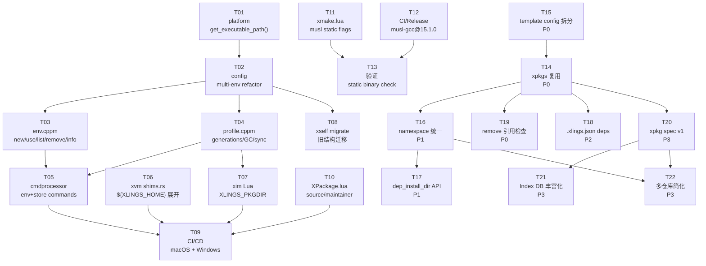

# xlings C++23 迁移 — 任务总览

> 父文档: [../README.md](../README.md) | 设计文档: [../main.md](../main.md)

---

## 任务列表

| ID | 任务 | 涉及语言 | Wave | 预估改动量 |
|----|------|---------|------|-----------|
| [T01](T01-platform-exe-path.md) | `get_executable_path()` 三平台实现 | C++ | 1 | ~30 行 |
| [T02](T02-config-multienv.md) | config 多环境重构 | C++ | 2 | ~60 行 |
| [T03](T03-env-module.md) | 新建 env.cppm | C++ | 3 | ~120 行 |
| [T04](T04-profile-module.md) | 新建 profile.cppm | C++ | 3 | ~150 行 |
| [T05](T05-cmdprocessor-update.md) | cmdprocessor 新增命令 | C++ | 4 | ~40 行 |
| [T06](T06-xvm-var-expand.md) | xvm 变量展开 | Rust | 1 | ~15 行 |
| [T07](T07-xim-pkgdir.md) | xim XLINGS_PKGDIR 支持 | Lua | 1 | ~5 行 |
| [T08](T08-self-migrate.md) | xself migrate 命令 | C++ | 4 | ~80 行 |
| [T09](T09-ci-multiplatform.md) | CI/CD 多平台补齐 | YAML | 5 | ~100 行 |
| [T10](T10-pkg-taxonomy-impl.md) | XPackage.lua 新增字段 | Lua | 1 | ~10 行 |
| [T11](T11-xmake-musl-static.md) | xmake.lua musl 静态链接配置 | Lua | 1 | ~10 行 |
| [T12](T12-ci-musl-gcc.md) | CI/Release 切换 musl-gcc@15.1.0 | YAML | 1 | ~30 行 |
| [T13](T13-verify-static-binary.md) | musl 静态二进制验证 | — | 2 | 无代码改动 |
| [T14](T14-xpkgs-reuse.md) | 多 subos 安装复用 xpkgs（框架层拦截） | Lua | 1 | ~20 行 |
| [T15](T15-install-config-split.md) | template.lua config 拆分 + 2 个 xpkg 补 config | Lua | 1 | ~10 行 |
| [T16](T16-namespace-unify.md) | 命名空间解析统一 | Lua | 2 | ~40 行 |
| [T17](T17-dep-install-dir.md) | dep_install_dir API | Lua | 2 | ~30 行 |
| [T18](T18-config-deps.md) | 项目级 .xlings.json 依赖声明 | C++ | 3 | ~60 行 |
| [T19](T19-remove-refcheck.md) | remove 时引用检查，防止误删共享 xpkgs | Lua | 1 | ~25 行 |
| [T20](T20-xpkg-spec-v1.md) | xpkg spec 版本字段 + 字段规范化 | Lua | 4 | ~30 行 |
| [T21](T21-indexdb-enrich.md) | Index DB 丰富化（type/desc/categories） | Lua | 4 | ~15 行 |
| [T22](T22-repo-simplify.md) | 多仓库简化（xim-pkgindex + awesome） | Lua | 5 | ~40 行 |
| [T23](T23-hybrid-view-impl.md) | data/xpkgs + subos 混合视图落地 | Lua/Rust | 6 | ~120 行 |
| [T24](T24-shim-init-module.md) | init 模块 + config/xvm 模板 + xself cmd_init | C++ | 独立 | ~120 行 |
| [T25](T25-subos-create-unified.md) | subos create 改用 init + 从 config 复制 xvm | C++ | 依赖 T24 | ~40 行 |
| [T26](T26-release-scripts-unified.md) | 发布脚本三平台统一（xmake + config + init） | Bash/PS1 | 依赖 T24 | ~80 行 |
| [T27](T27-ci-fix-shim-mirror-macos.md) | CI 修复：shim 初始化 + 镜像切换 + macOS 兼容 | YAML/Bash/C++ | 依赖 T24-T26 | ~50 行 |

---

## 依赖拓扑图



---

## 并行 Wave 分组

Agent 并行执行策略：同一 Wave 内的任务互相独立，可同时分配给多个 Agent。

### Wave 1 — 完全独立，6 个 Agent 并行

| 任务 | 说明 | 文件 |
|------|------|------|
| T01 | platform 三平台添加 `get_executable_path()` | `core/platform/linux.cppm` 等 |
| T06 | xvm shims.rs 添加 `expand_xlings_vars()` | `core/xvm/xvmlib/shims.rs` |
| T07 | xim Lua 读取 `XLINGS_PKGDIR` | `core/xim/base/runtime.lua` |
| T10 | XPackage.lua 添加 `source`/`maintainer` | `core/xim/pm/XPackage.lua` |
| T11 | xmake.lua musl 静态链接配置 | `xmake.lua` |
| T12 | CI/Release 切换 musl-gcc@15.1.0 | `.github/workflows/*.yml` |

### Wave 1.5 — 等待 T11+T12，1 个 Agent

| 任务 | 说明 | 依赖 |
|------|------|------|
| T13 | musl 静态二进制验证与回归测试 | T11 + T12 |

### Wave 2 — 等待 T01，1 个 Agent

| 任务 | 说明 | 依赖 |
|------|------|------|
| T02 | config.cppm 多环境重构 | T01（需要 `get_executable_path()`） |

### Wave 3 — 等待 T02，2 个 Agent 并行

| 任务 | 说明 | 依赖 |
|------|------|------|
| T03 | 新建 core/env.cppm | T02（需要新的 Config::PathInfo） |
| T04 | 新建 core/profile.cppm | T02（需要 envDir 路径解析） |

### Wave 4 — 等待 T03+T04，2 个 Agent 并行

| 任务 | 说明 | 依赖 |
|------|------|------|
| T05 | cmdprocessor 新增 env/store 命令 | T03 + T04（需要模块接口） |
| T08 | xself.cppm 新增 migrate 子命令 | T02（需要新目录结构定义） |

### Wave 5 — 等待全部，1 个 Agent

| 任务 | 说明 | 依赖 |
|------|------|------|
| T09 | CI/CD 多平台补齐 | 所有任务（需代码全部就绪） |

---

## xim 模块改进任务（T14-T18）

> 设计文档: [../xim-issues-design.md](../xim-issues-design.md)

### xim-Wave 1 — P0 优先，3 个任务

| 任务 | 说明 | 文件 | 依赖 |
|------|------|------|------|
| T15 | template.lua config 拆分 + 2 个 xpkg 补 config | `template.lua`, `rustup.lua`, `musl-cross-make.lua` | 无 |
| T14 | 多 subos 安装复用 xpkgs（框架层拦截） | `PkgManagerExecutor.lua`, `XPkgManager.lua` | T15 |
| T19 | remove 时引用检查，防止误删共享 xpkgs | `XPkgManager.lua` | 可与 T14 并行 |

### xim-Wave 2 — P1 改进，2 个 Agent 并行

| 任务 | 说明 | 依赖 |
|------|------|------|
| T16 | 命名空间解析统一 | T14 |
| T17 | dep_install_dir API | T16 |

### xim-Wave 3 — P2 新功能，1 个 Agent

| 任务 | 说明 | 依赖 |
|------|------|------|
| T18 | 项目级 .xlings.json 依赖声明与批量安装 | T14（建议） |

### xim-Wave 4 — P3 规范化，2 个 Agent 并行

| 任务 | 说明 | 依赖 |
|------|------|------|
| T20 | xpkg spec 版本字段 + 字段规范化 | T14 |
| T21 | Index DB 丰富化（type/desc/categories） | T20 |

### xim-Wave 5 — P3 多仓库简化，1 个 Agent

| 任务 | 说明 | 依赖 |
|------|------|------|
| T22 | 多仓库简化（只保留 xim-pkgindex + awesome） | T20, T16 |

### xim-Wave 6 — P2 混合视图落地，1 个 Agent

| 任务 | 说明 | 依赖 |
|------|------|------|
| T23 | data/xpkgs + subos 混合视图落地（聚合 + 闭包） | T14, T16, T17（建议含 T18） |

---

### 短命令与 xvm 统一（T24-T26）

> 设计文档: [../shim-unified-design.md](../shim-unified-design.md)

| 任务 | 说明 | 依赖 |
|------|------|------|
| T24 | init 模块 + config/xvm 模板 + xself cmd_init 调用 ensure_subos_shims | 无 |
| T25 | subos create 从 config 复制 xvm，调用 ensure_subos_shims | T24 |
| T26 | 发布脚本三平台统一：xmake 打包、config 复制两次、调用 init | T24 |
| T27 | CI 修复：Phase 3 添加 self init + 镜像切换 + macOS xmake bundle 跳过 | T24-T26 |

---

## 验收总标准

所有任务完成后，执行以下验证：

```bash
# ── Wave 1 验收 ──────────────────────────────────────

# T01: 自包含检测（可执行文件同级有 xim/ 则自动设置 XLINGS_HOME）
tar -xzf xlings-*.tar.gz
./xlings-*/bin/xlings --version   # 无需设置任何环境变量

# T06: xvm 变量展开（移动 HOME 后工具仍可用）
mv ~/.xlings /tmp/xlings-moved
XLINGS_HOME=/tmp/xlings-moved /tmp/xlings-moved/bin/xlings env list

# T07: xim 使用全局 xpkgs
XLINGS_PKGDIR=/shared/xpkgs xlings install cmake  # 安装到指定目录

# T10: 包信息显示新字段
xlings info cmake   # 输出包含 source: upstream, maintainer: xlings

# ── Wave 2 验收 ──────────────────────────────────────

# T02: Config 路径解析
# (在 xlings 源码添加临时调试输出，确认路径解析正确)
# XLINGS_HOME → envs/default 作为 XLINGS_DATA
# XLINGS_PKGDIR → xim/xpkgs

# ── Wave 3 验收 ──────────────────────────────────────

# T03: env 子命令
xlings env new work
xlings env list          # 显示 [default](*) 和 work
xlings env use work
xlings env list          # 显示 default 和 [work](*)
xlings env info work     # 显示路径和已激活工具数
xlings env remove work   # 删除（非当前活跃环境）

# T04: profile 世代
xlings install cmake     # env=work
ls ~/.xlings/envs/work/generations/  # 存在 001.json
cat ~/.xlings/envs/work/generations/001.json  # 包含 cmake: 4.0.2

# ── Wave 4 验收 ──────────────────────────────────────

# T05: 完整命令链
xlings env new dev
xlings env use dev
xlings install dadk
xlings env rollback --to 0   # 回到初始状态（无 dadk）
xlings store gc --dry-run    # 列出可清理的包版本

# T08: 数据迁移
# 模拟旧版数据结构，运行迁移
xlings self migrate          # 执行迁移
ls ~/.xlings/envs/default/   # 存在 bin/ xvm/ generations/ .profile.json

# ── Wave 5 验收 ──────────────────────────────────────

# T09: CI 三平台均绿
# Linux x86_64, macOS arm64, Windows x86_64 均有产物

# ── xim 模块验收 ─────────────────────────────────────

# T15: template config 拆分
# template.lua 中 install() 不含 xvm.add()，config() 中含 xvm.add()
# rustup.lua 和 musl-cross-make.lua 补齐了 config()

# T14: xpkgs 复用
xlings subos new test-reuse
xlings subos use test-reuse
xlings install cmake -y      # 期望: 跳过下载, 输出 "reuse xpkgs, skip download"
cmake --version               # 期望: 正常输出版本号
xlings subos use default
xlings subos remove test-reuse

# T19: remove 引用检查
xlings subos new test-ref
xlings subos use test-ref
xlings install cmake -y
xlings remove cmake -y       # 期望: 输出 "other subos still using, keep xpkgs files"
xlings subos use default
cmake --version               # 期望: default 中 cmake 仍正常
xlings subos remove test-ref

# T16: 命名空间统一
xlings install d2x -y         # 期望: 依赖库聚合不靠硬编码 namespace
d2x --version                  # 期望: 正常运行

# T17: dep_install_dir API
# pkginfo.dep_install_dir("glibc") 返回正确路径

# T18: 项目级 .xlings.json 依赖
cd /tmp && mkdir test-proj && cd test-proj
echo '{"name":"test","deps":["cmake"]}' > .xlings.json
xlings install                 # 期望: 自动安装 cmake

# T20: xpkg spec v1
# spec = "1" 的包正常安装/卸载
# 无 spec 字段的旧包兼容工作

# T21: Index DB 丰富化
xim --update index
# 期望: xim-index-db.lua 中条目包含 type/description 字段

# T22: 多仓库简化
# 新安装 xlings 首次 sync 不拉取子仓库
# 已有用户 xim-indexrepos.json 继续工作

# ── 短命令与 xvm 统一验收（T24-T26）──────────────────────────

# T24: init 模块
xlings self init                    # 开发环境不报错
# 发布包解压后
XLINGS_HOME=/path/to/pkg ./bin/xlings self init
ls subos/default/bin/               # 8 个 shim

# T25: subos create
xlings subos new test
ls ~/.xlings/subos/test/bin/        # 7 或 8 个 shim
ls ~/.xlings/subos/test/xvm/        # versions.xvm.yaml, .workspace.xvm.yaml

# T26: 发布脚本
./tools/linux_release.sh
./tools/macos_release.sh
pwsh ./tools/windows_release.ps1
# 解压各平台包，检查 subos/default/bin 含 8 个 shim
```

---

## 关键设计参考速查

| 查询 | 参考文档位置 |
|------|------------|
| `Config::PathInfo` 新字段 | [T02](T02-config-multienv.md) §4 |
| `xlings.env` 模块完整接口 | [T03](T03-env-module.md) §4 |
| `xlings.profile` 模块完整接口 | [T04](T04-profile-module.md) §4 |
| 世代 JSON 格式 | [../env-store-design.md §3.3](../env-store-design.md) |
| `expand_xlings_vars()` 实现 | [T06](T06-xvm-var-expand.md) §4 |
| 目录迁移映射关系 | [T08](T08-self-migrate.md) §4 |
| musl 静态构建设计 | [../release-static-build.md](../release-static-build.md) |
| xmake.lua musl 链接配置 | [T11](T11-xmake-musl-static.md) §4 |
| CI musl-gcc SDK 配置 | [T12](T12-ci-musl-gcc.md) §4 |
| 静态二进制验证清单 | [T13](T13-verify-static-binary.md) §3 |
| xim 模块问题总览 | [../xim-issues-design.md](../xim-issues-design.md) |
| xpkgs 复用方案 | [T14](T14-xpkgs-reuse.md) §4 |
| install/config 分离规范 | [T15](T15-install-config-split.md) §4 |
| 命名空间统一方案 | [T16](T16-namespace-unify.md) §4 |
| dep_install_dir API | [T17](T17-dep-install-dir.md) §4 |
| 项目级 .xlings.json 依赖声明 | [T18](T18-config-deps.md) §4 |
| remove 引用检查方案 | [T19](T19-remove-refcheck.md) §4 |
| xpkg spec v1 规范 | [T20](T20-xpkg-spec-v1.md) §3 |
| Index DB 丰富化 | [T21](T21-indexdb-enrich.md) §3 |
| 多仓库简化方案 | [T22](T22-repo-simplify.md) §3 |
| xpkgs/subos 混合视图落地 | [T23](T23-hybrid-view-impl.md) §3 |
| xpkg 规范化总览与路线图 | [../xpkg-spec-design.md](../xpkg-spec-design.md) |
| 短命令与 xvm 配置统一设计 | [../shim-unified-design.md](../shim-unified-design.md) |
| init 模块与 ensure_subos_shims | [T24](T24-shim-init-module.md) §3 |
| subos create 统一逻辑 | [T25](T25-subos-create-unified.md) §4 |
| 发布脚本三平台统一 | [T26](T26-release-scripts-unified.md) §4 |
| CI 修复（shim/镜像/macOS）| [T27](T27-ci-fix-shim-mirror-macos.md) §3 |
