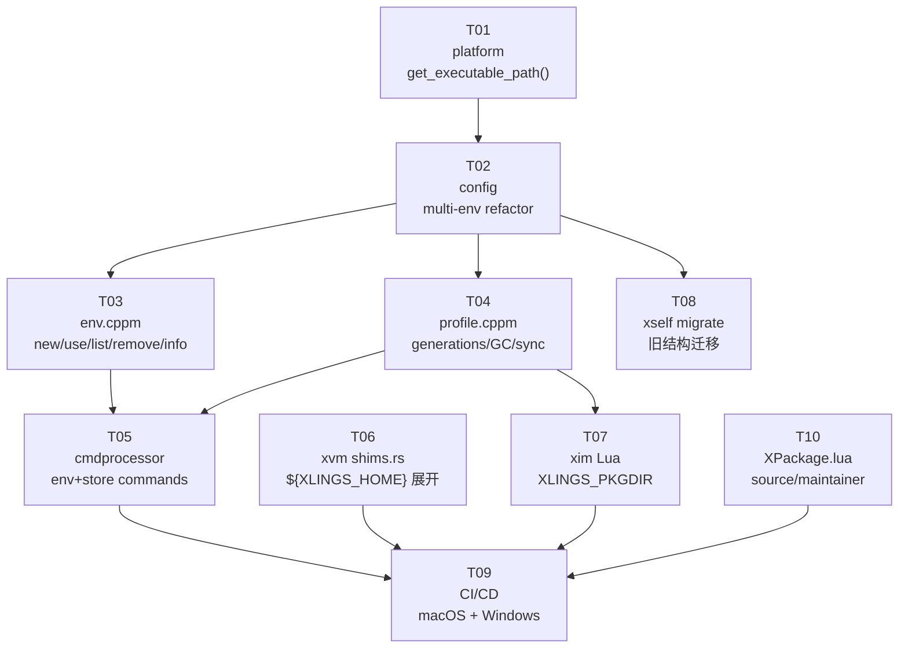

# xlings C++23 迁移 — 任务总览

> 父文档: [../README.md](../README.md) | 设计文档: [../main.md](../main.md)

---

## 任务列表

| ID | 任务 | 涉及语言 | Wave | 预估改动量 |
|----|------|---------|------|-----------|
| [T01](T01-platform-exe-path.md) | `get_executable_path()` 三平台实现 | C++ | 1 | ~30 行 |
| [T02](T02-config-multienv.md) | config 多环境重构 | C++ | 2 | ~60 行 |
| [T03](T03-env-module.md) | 新建 env.cppm | C++ | 3 | ~120 行 |
| [T04](T04-profile-module.md) | 新建 profile.cppm | C++ | 3 | ~150 行 |
| [T05](T05-cmdprocessor-update.md) | cmdprocessor 新增命令 | C++ | 4 | ~40 行 |
| [T06](T06-xvm-var-expand.md) | xvm 变量展开 | Rust | 1 | ~15 行 |
| [T07](T07-xim-pkgdir.md) | xim XLINGS_PKGDIR 支持 | Lua | 1 | ~5 行 |
| [T08](T08-self-migrate.md) | xself migrate 命令 | C++ | 4 | ~80 行 |
| [T09](T09-ci-multiplatform.md) | CI/CD 多平台补齐 | YAML | 5 | ~100 行 |
| [T10](T10-pkg-taxonomy-impl.md) | XPackage.lua 新增字段 | Lua | 1 | ~10 行 |

---

## 依赖拓扑图



---

## 并行 Wave 分组

Agent 并行执行策略：同一 Wave 内的任务互相独立，可同时分配给多个 Agent。

### Wave 1 — 完全独立，4 个 Agent 并行

| 任务 | 说明 | 文件 |
|------|------|------|
| T01 | platform 三平台添加 `get_executable_path()` | `core/platform/linux.cppm` 等 |
| T06 | xvm shims.rs 添加 `expand_xlings_vars()` | `core/xvm/xvmlib/shims.rs` |
| T07 | xim Lua 读取 `XLINGS_PKGDIR` | `core/xim/base/runtime.lua` |
| T10 | XPackage.lua 添加 `source`/`maintainer` | `core/xim/pm/XPackage.lua` |

### Wave 2 — 等待 T01，1 个 Agent

| 任务 | 说明 | 依赖 |
|------|------|------|
| T02 | config.cppm 多环境重构 | T01（需要 `get_executable_path()`） |

### Wave 3 — 等待 T02，2 个 Agent 并行

| 任务 | 说明 | 依赖 |
|------|------|------|
| T03 | 新建 core/env.cppm | T02（需要新的 Config::PathInfo） |
| T04 | 新建 core/profile.cppm | T02（需要 envDir 路径解析） |

### Wave 4 — 等待 T03+T04，2 个 Agent 并行

| 任务 | 说明 | 依赖 |
|------|------|------|
| T05 | cmdprocessor 新增 env/store 命令 | T03 + T04（需要模块接口） |
| T08 | xself.cppm 新增 migrate 子命令 | T02（需要新目录结构定义） |

### Wave 5 — 等待全部，1 个 Agent

| 任务 | 说明 | 依赖 |
|------|------|------|
| T09 | CI/CD 多平台补齐 | 所有任务（需代码全部就绪） |

---

## 验收总标准

所有任务完成后，执行以下验证：

```bash
# ── Wave 1 验收 ──────────────────────────────────────

# T01: 自包含检测（可执行文件同级有 xim/ 则自动设置 XLINGS_HOME）
tar -xzf xlings-*.tar.gz
./xlings-*/bin/xlings --version   # 无需设置任何环境变量

# T06: xvm 变量展开（移动 HOME 后工具仍可用）
mv ~/.xlings /tmp/xlings-moved
XLINGS_HOME=/tmp/xlings-moved /tmp/xlings-moved/bin/xlings env list

# T07: xim 使用全局 xpkgs
XLINGS_PKGDIR=/shared/xpkgs xlings install cmake  # 安装到指定目录

# T10: 包信息显示新字段
xlings info cmake   # 输出包含 source: upstream, maintainer: xlings

# ── Wave 2 验收 ──────────────────────────────────────

# T02: Config 路径解析
# (在 xlings 源码添加临时调试输出，确认路径解析正确)
# XLINGS_HOME → envs/default 作为 XLINGS_DATA
# XLINGS_PKGDIR → xim/xpkgs

# ── Wave 3 验收 ──────────────────────────────────────

# T03: env 子命令
xlings env new work
xlings env list          # 显示 [default](*) 和 work
xlings env use work
xlings env list          # 显示 default 和 [work](*)
xlings env info work     # 显示路径和已激活工具数
xlings env remove work   # 删除（非当前活跃环境）

# T04: profile 世代
xlings install cmake     # env=work
ls ~/.xlings/envs/work/generations/  # 存在 001.json
cat ~/.xlings/envs/work/generations/001.json  # 包含 cmake: 4.0.2

# ── Wave 4 验收 ──────────────────────────────────────

# T05: 完整命令链
xlings env new dev
xlings env use dev
xlings install dadk
xlings env rollback --to 0   # 回到初始状态（无 dadk）
xlings store gc --dry-run    # 列出可清理的包版本

# T08: 数据迁移
# 模拟旧版数据结构，运行迁移
xlings self migrate          # 执行迁移
ls ~/.xlings/envs/default/   # 存在 bin/ xvm/ generations/ .profile.json

# ── Wave 5 验收 ──────────────────────────────────────

# T09: CI 三平台均绿
# Linux x86_64, macOS arm64, Windows x86_64 均有产物
```

---

## 关键设计参考速查

| 查询 | 参考文档位置 |
|------|------------|
| `Config::PathInfo` 新字段 | [T02](T02-config-multienv.md) §4 |
| `xlings.env` 模块完整接口 | [T03](T03-env-module.md) §4 |
| `xlings.profile` 模块完整接口 | [T04](T04-profile-module.md) §4 |
| 世代 JSON 格式 | [../env-store-design.md §3.3](../env-store-design.md) |
| `expand_xlings_vars()` 实现 | [T06](T06-xvm-var-expand.md) §4 |
| 目录迁移映射关系 | [T08](T08-self-migrate.md) §4 |
