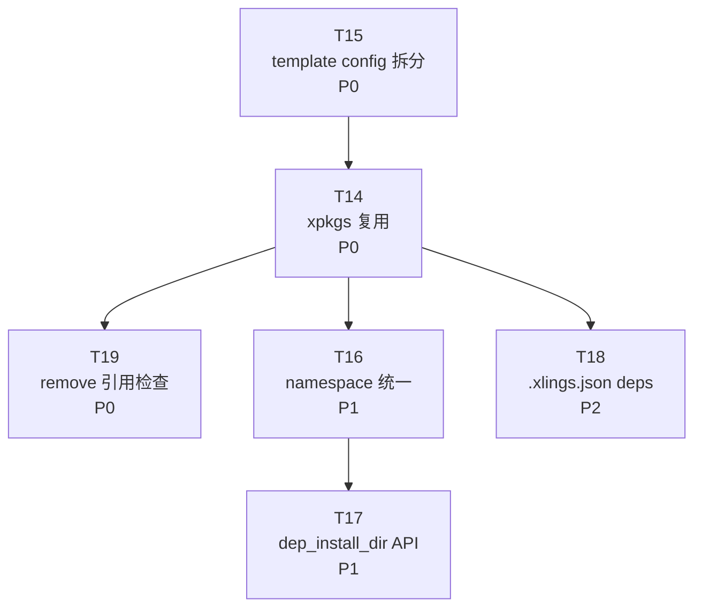

# xim 模块问题分析与改进设计

> 关联文档:
> - [env-store-design.md — xpkgs Store 与多环境设计](env-store-design.md)
> - [main.md — 顶层设计方案](main.md)
> - [xpkg-spec-design.md — xpkg 规范化设计与路线图](xpkg-spec-design.md)
> - [tasks/README.md — 任务总览](tasks/README.md)

---

## 一、问题总览

当前 xim 模块存在四个层面的问题：

| 编号 | 问题 | 优先级 | 影响范围 |
|------|------|--------|---------|
| P0-a | 多 subos 安装不复用 xpkgs，每次重新下载解压 | P0 | 性能、用户体验 |
| P0-b | remove 时无条件删除 xpkgs 文件，破坏其他 subos | P0 | 数据安全 |
| P1 | 新老 xpkg 包命名空间不兼容，依赖路径查找靠硬编码猜测 | P1 | 可维护性、正确性 |
| P2 | 缺少项目级依赖声明，无法一键安装项目依赖 | P2 | 功能缺失 |

---

## 二、问题一：多 subos 安装不复用 xpkgs（P0-a）

### 2.1 现状

xpkgs 是全局共享的包存储，每个 subos 有独立的 xvm 注册表：

```
全局共享:      $XLINGS_DATA/xpkgs/gcc/15.1.0/     ← 包的物理文件
Per-subos:    $XLINGS_HOME/subos/<name>/xvm/       ← xvm 注册表
              $XLINGS_HOME/subos/<name>/bin/       ← 激活的工具
              $XLINGS_HOME/subos/<name>/lib/       ← 依赖库聚合
```

### 2.2 问题根因

当用户切换到新 subos 后安装包时：

```
1. installed() 检查新 subos 的 xvm → 返回 false（新 subos 未注册）
2. download()  → 重新下载包文件
3. install()   → 删除 xpkgs 中已有文件，重新写入
4. config()    → 注册到新 subos 的 xvm
```

**本质问题**：`installed()` 基于 per-subos 的 xvm 注册判断，但 `install()` 操作的是全局 xpkgs。xpkgs 中已有的包被当作"未安装"而重新处理。

### 2.3 解决方案：框架层拦截 + config 兜底

核心思路：在 `PkgManagerExecutor:install()` 中检测 xpkgs 是否已有包文件，已有则**跳过整个 install hook**（download + build + install 全部跳过），只调 `config()` 完成当前 subos 的激活。

由于是在框架层拦截，xpkg.lua 中的 `os.tryrm(install_dir)` 等代码根本不会执行，**无需修改任何 xpkg.lua 文件**。

#### 2.3.1 改造 PkgManagerExecutor:install()

```lua
-- core/xim/pm/PkgManagerExecutor.lua
function PkgManagerExecutor:install()
    os.cd(runtime.get_runtime_dir())

    if self.type == "xpm" then
        local pkginfo = runtime.get_pkginfo()

        if _xpkgs_has_files(pkginfo.install_dir) then
            cprint("[xlings:xim]: ${dim}reuse xpkgs, skip download${clear}")
        else
            if not self:_download() or not self:_build() then
                cprint("[xlings:xim]: hooks: ${red}download or build failed${clear}")
                return false
            end
            cprint("[xlings:xim]: start install ${green}%s${clear}...", self._pkg.name)
            if not _try_execute(self, "install") then
                cprint("[xlings:xim]: hooks.install: ${red}install failed${clear}")
                return false
            end
        end

        -- config 始终执行（无论是否跳过 install）
        if not self:_config() then
            cprint("[xlings:xim]: hooks.config: ${red}config failed${clear}")
            return false
        end
        return true
    end

    -- 非 xpm 类型，原有逻辑
    cprint("[xlings:xim]: start install ${green}%s${clear}...", self._pkg.name)
    if not _try_execute(self, "install") then
        return false
    end
    return true
end

function _xpkgs_has_files(install_dir)
    if not os.isdir(install_dir) then return false end
    local entries = os.files(path.join(install_dir, "*"))
    return entries and #entries > 0
end
```

#### 2.3.2 XPkgManager:config() 增加 template 类型兜底

当前 44 个有 `install()` 的包中，30 个有自定义 `config()`，14 个没有。分析这 14 个包：

| 类别 | 包 | 是否涉及 subos 切换 |
|------|---|-------------------|
| 系统级一次性操作 | nvm, wsl-ubuntu, powershell-execpolicy, msvc, cpp 等 | 不涉及 |
| Windows 专属 | windows-acp, vs-buildtools | 不涉及 |
| 外部文件修改 | gitcode-hosts, rust-crates-mirror, rustup-mirror, fontconfig | 不涉及 |
| 有 xvm.add 需补 config | rustup, musl-cross-make | 需补 config（2 个） |
| 基础设施 | xvm | 不需要 config |

绝大多数无 config() 的包是一次性系统操作或 Windows 专属，不涉及 subos 切换。只有 `rustup.lua` 和 `musl-cross-make.lua` 需要补一个简单的 `config()`。

同时，在 `XPkgManager:config()` 中为 template 类型包增加框架级兜底：

```lua
-- core/xim/pm/XPkgManager.lua
function XPkgManager:config(xpkg)
    if not xpkg.hooks["config"] then
        if xpkg.type == "template" then
            xpkg.hooks["config"] = function()
                return types.template.config(xpkg)
            end
        end
    end
    return _try_execute_hook(xpkg.name, xpkg, "config")
end
```

对应地，`template.lua` 新增 `config()` 函数（将 `xvm.add` 从 `install` 移入）：

```lua
-- core/xim/pm/types/template.lua
function install(xpkg)
    local pkginfo = runtime.get_pkginfo()
    local pkgdir = pkginfo.install_file
        :replace(".zip", ""):replace(".tar.gz", ""):replace(".git", "")
    os.tryrm(pkginfo.install_dir)
    if not os.trymv(pkgdir, pkginfo.install_dir) then
        return false
    end
    return true  -- 不再调用 xvm.add
end

function config(xpkg)
    xvm.add(__get_xvm_pkgname(xpkg))
    return true
end
```

#### 2.3.3 config() 的定位

`config()` 的职责明确为 **per-subos 激活**，包括：

- xvm 注册（注册到当前 subos 的 xvm workspace）
- subos 环境配置（header 拷贝到 subos sysroot、lib 软链等）
- 环境变量设置（如 LD_LIBRARY_PATH 指向 subos/lib）

这些操作在每个 subos 中都需要独立执行一次。现有 30 个自定义 `config()` 的包已经遵循这个模式。

#### 2.3.4 依赖链的自动递归

`CmdProcessor:install()` 处理依赖时递归调用 `new(dep_name, {install=true}):run()`。依赖包也会进入 `PkgManagerExecutor:install()`，因此 xpkgs 复用逻辑对整个依赖链**自动生效**——无需额外处理。

详见: [tasks/T14-xpkgs-reuse.md](tasks/T14-xpkgs-reuse.md), [tasks/T15-install-config-split.md](tasks/T15-install-config-split.md)

---

## 三、问题二：remove 时无条件删除 xpkgs 文件（P0-b）

### 3.1 现状

`XPkgManager:uninstall()` 在执行 uninstall hook 后**无条件删除** xpkgs 目录：

```lua
-- core/xim/pm/XPkgManager.lua:148-154
local installdir = runtime.get_pkginfo().install_dir
if not os.tryrm(installdir) and os.isdir(installdir) then
    sudo.exec("rm -rf " .. installdir)
end
```

### 3.2 问题

在共享 xpkgs 的多 subos 架构下，这会破坏其他 subos 的包：

```
SubOS A 和 SubOS B 都激活了 cmake@4.0.2
用户在 SubOS A 中执行 xlings remove cmake
→ uninstall hook: 从 SubOS A 的 xvm 注销
→ os.tryrm(xpkgs/cmake/4.0.2/)  ← 直接删除！
→ SubOS B 的 cmake 坏了（底层文件被删）
```

### 3.3 解决方案：remove 只做 deactivate，GC 负责清理

**remove 时只注销当前 subos 的 xvm 注册，不删 xpkgs 文件**。通过扫描所有 subos 的 xvm 注册表来判断是否有其他 subos 仍在使用：

```lua
-- core/xim/pm/XPkgManager.lua
function XPkgManager:uninstall(xpkg)
    -- 1. 执行 xpkg 的 uninstall hook（xvm 注销）
    local ret = _try_execute_hook(xpkg.name, xpkg, "uninstall")

    -- 2. 检查是否还有其他 subos 在使用
    local installdir = runtime.get_pkginfo().install_dir
    if _any_other_subos_using(xpkg.name) then
        cprint("[xlings:xim]: ${dim}other subos still using, keep xpkgs files${clear}")
    else
        cprint("[xlings:xim]: no other references, removing - ${dim}%s", installdir)
        if not os.tryrm(installdir) and os.isdir(installdir) then
            sudo.exec("rm -rf " .. installdir)
        end
    end
    return ret
end
```

引用检查通过扫描所有 subos 的 xvm workspace 文件实现（无需维护额外的引用计数注册表）：

```lua
function _any_other_subos_using(pkgname)
    local current_subos = path.filename(platform.get_config_info().subosdir)
    local subos_root = path.join(platform.get_config_info().homedir, "subos")
    local subos_dirs = os.dirs(path.join(subos_root, "*"))

    for _, subos_dir in ipairs(subos_dirs or {}) do
        local name = path.filename(subos_dir)
        if name ~= current_subos and name ~= "current" then
            local workspace_file = path.join(subos_dir, "xvm", ".workspace.xvm.yaml")
            if os.isfile(workspace_file) then
                local content = io.readfile(workspace_file)
                if content:find(pkgname, 1, true) then
                    return true
                end
            end
        end
    end
    return false
end
```

**优势**：
- 不需要维护引用计数注册表，避免一致性问题
- 每次直接扫描真实的 xvm 状态，结果可靠
- subos 数量通常个位数，扫描几个 yaml 文件开销可忽略

**兜底清理**：`xlings self clean` 已有 GC 逻辑（`profile::gc()`），可扫描所有 subos 的 xvm，删除 xpkgs 中无引用的包。

详见: [tasks/T19-remove-refcheck.md](tasks/T19-remove-refcheck.md)

---

## 四、问题三：命名空间与依赖路径不兼容（P1）

### 4.1 现状

xpkg 安装目录名由命名空间决定：

```lua
-- core/xim/pm/XPkgManager.lua:237-240
local pkgname = xpkg.name
if xpkg.namespace then
    pkgname = xpkg.namespace .. "-x-" .. pkgname
end
local install_dir = path.join(runtime.get_xim_install_basedir(), pkgname, xpkg.version)
```

但 `aggregate_dep_libs_to()` 查找依赖时硬编码猜测多个前缀：

```lua
-- core/xim/CmdProcessor.lua:24
for _, try_name in ipairs({name, "scode-x-" .. name, "fromsource-x-" .. name}) do
```

xpkg.lua 中也存在硬编码，如 `glibc.lua:179`:

```lua
local fromsource_glibc = "fromsource-x-" .. package.name
```

### 4.2 问题

- 命名空间与安装目录名的映射规则没有统一注册，每个消费者需要自己猜测
- 新增命名空间时，所有消费者都需要修改
- xpkg.lua 内部硬编码其他包的命名空间前缀，耦合严重

### 4.3 解决方案

- 在 xvm 注册时记录完整的安装路径信息，后续通过 xvm info 查询
- 在 `libxpkg/pkginfo.lua` 中增加 `dep_install_dir(dep_name)` API
- 改造 `aggregate_dep_libs_to()` 使用 xvm 注册信息而非硬编码猜测

详见: [tasks/T16-namespace-unify.md](tasks/T16-namespace-unify.md), [tasks/T17-dep-install-dir.md](tasks/T17-dep-install-dir.md)

---

## 五、问题四：缺少项目级依赖声明（P2）

### 5.1 现状

老版本 xlings 有 `config.xlings`（Lua 格式）文件用于项目初始化，但从未实现依赖声明和批量安装逻辑。当前 `xlings install` 只支持单包安装。

同时，`$XLINGS_HOME/.xlings.json` 已作为全局配置文件在使用（存储 activeSubos、mirror、xim 等设置）。

### 5.2 解决方案

复用 `.xlings.json` 格式，在**项目目录**中放置一个 `.xlings.json` 作为项目级配置文件，声明项目依赖：

```json
{
    "name": "my-project",
    "lang": "c",
    "deps": [
        "gcc@15.1.0",
        "cmake",
        "d2x@0.1.3"
    ]
}
```

两个层级的 `.xlings.json` 通过位置区分作用域：

| 位置 | 作用域 | 典型内容 |
|------|--------|---------|
| `$XLINGS_HOME/.xlings.json` | 全局 | activeSubos, mirror, xim 配置 |
| `<project>/.xlings.json` | 项目级 | 项目名、语言、依赖列表 |

当 `xlings install` 不带参数时，在当前目录及父目录查找 `.xlings.json`（排除 `$XLINGS_HOME/.xlings.json`），解析 `deps` 字段并批量安装。C++ 侧已有 `nlohmann::json` 库，无需额外引入 Lua 解析。

详见: [tasks/T18-config-deps.md](tasks/T18-config-deps.md)

---

## 六、改动量总结

| 文件 | 改动 | 行数 |
|------|------|------|
| `PkgManagerExecutor.lua` | install 中增加 xpkgs 拦截，config 始终执行 | ~15 行 |
| `XPkgManager.lua:config()` | template 类型 config 兜底 | ~5 行 |
| `XPkgManager.lua:uninstall()` | 删除前检查其他 subos 引用 | ~20 行 |
| `template.lua` | 新增 config()，xvm.add 从 install 移入 | ~5 行 |
| `rustup.lua` | 补 config()（xvm.add 移出 install） | ~3 行 |
| `musl-cross-make.lua` | 补 config()（xvm.add 移出 install） | ~3 行 |

P0 核心改动：**约 50 行，6 个文件**。

---

## 七、任务拆分总览

| ID | 任务 | 优先级 | 涉及文件 | Wave |
|----|------|--------|---------|------|
| [T14](tasks/T14-xpkgs-reuse.md) | 多 subos 安装复用 xpkgs（框架层拦截） | P0 | `PkgManagerExecutor.lua`, `XPkgManager.lua` | 1 |
| [T15](tasks/T15-install-config-split.md) | template.lua config 拆分 + 2 个 xpkg 补 config | P0 | `template.lua`, `rustup.lua`, `musl-cross-make.lua` | 1 |
| [T19](tasks/T19-remove-refcheck.md) | remove 时引用检查，防止误删共享 xpkgs | P0 | `XPkgManager.lua` | 1 |
| [T16](tasks/T16-namespace-unify.md) | 命名空间解析统一 | P1 | `CmdProcessor.lua`, `XPkgManager.lua` | 2 |
| [T17](tasks/T17-dep-install-dir.md) | dep_install_dir API | P1 | `libxpkg/pkginfo.lua` | 2 |
| [T18](tasks/T18-config-deps.md) | 项目级 .xlings.json 依赖声明 | P2 | `cmdprocessor.cppm` | 3 |

### 依赖拓扑



- T15 是 T14 的前提（config 必须能独立工作）
- T14 和 T19 都是 P0，T19 可与 T14 并行
- T16/T17 是 P1，依赖 T14 完成
- T18 是独立的 P2 功能增强
