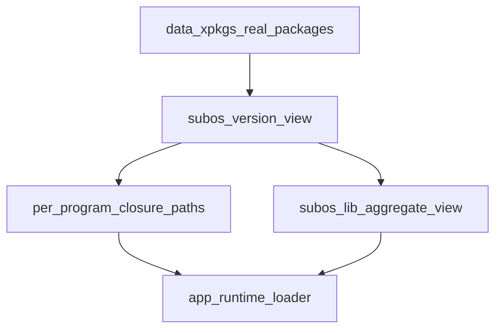

# data/xpkgs + subos 混合视图设计

> 关联文档: [elf-relocation-and-subos-design.md](elf-relocation-and-subos-design.md), [env-store-design.md](env-store-design.md), [rpath-and-os-vision.md](rpath-and-os-vision.md)

## 一、目标与结论

本文将 xlings 的包管理模型明确为两层:

- `data/xpkgs`: 固定真实包层（真实二进制和头文件资产）
- `subos`: 版本视图层（当前激活版本和运行时可见性）

在该分层下，系统同时支持两种能力:

- 聚合模式（兼容与易用）: 提供统一 `subos/lib` 默认视图
- 闭包模式（隔离与可复现）: 按程序绑定依赖闭包，直接指向 `data/xpkgs/<pkg>/<ver>/lib*`

结论: 这是一个可落地的混合架构。`data/xpkgs` 负责"存什么"，`subos` 负责"给谁看什么"。

子方案入口（顺序保证与规范落地）:

- [hybrid-libpath-order-subplan.md](hybrid-libpath-order-subplan.md)

## 二、分层定义

### 2.1 `data/xpkgs`: 固定真实包层

- 保存每个包版本的真实内容，不承载"当前版本"语义
- 路径稳定且可复用: `data/xpkgs/<pkg>/<version>/...`
- 允许多版本并存

### 2.2 `subos`: 版本视图层

- 保存当前 workspace/subos 的激活关系
- 对外暴露可执行入口、默认库视图和运行时环境
- 不复制真实包内容，只做映射（软链接/环境变量/启动包装）

## 三、两种运行模式

### 3.1 聚合模式（默认视图）

目标: 保持脚本与临时编译体验简单。

- `subos/lib` 提供扁平可见库集合
- 常见工具无需理解闭包即可运行
- 代价: 同名库可能后装覆盖先装，不保证同一 subos 下多版本并存

适用场景:

- 快速试用
- 单项目单版本依赖
- 兼容旧行为

### 3.2 闭包模式（按程序隔离）

目标: 保证依赖确定性、支持多版本共存。

- 每个程序记录自己的依赖闭包路径
- 运行时优先使用程序级闭包路径
- 闭包路径直接指向 `data/xpkgs/.../lib*`，不依赖扁平 `subos/lib`
- 闭包在当前环境生成（运行时/激活时），发布阶段不写死机器绝对路径

适用场景:

- 发布产物
- 多项目并行开发
- ABI 敏感依赖

## 四、统一解析优先级

建议统一为以下顺序:

1. 程序专属闭包路径（最高优先）
2. 程序二进制内 RUNPATH/RPATH
3. `subos/lib` 默认聚合路径（兼容层）
4. 系统默认搜索路径

这样可做到:

- 有闭包时强隔离
- 无闭包时不破坏现有体验

## 五、依赖视图与数据流

说明:

- `pkgStore` 只负责真实包
- `subosView` 生成两类视图: 聚合视图与闭包视图
- 运行时优先闭包，再 fallback 到聚合

## 六、为什么要混合而不是二选一

只做聚合:

- 易用，但多版本冲突风险高

只做闭包:

- 最干净，但对日常脚本和临时开发门槛较高

混合模式:

- 保留默认易用性
- 给需要确定性的场景提供强隔离路径
- 可以按程序渐进启用，不要求一次性迁移全部包

## 七、实现边界（必须遵守）

- `data/xpkgs` 不存激活态信息
- `subos` 不拷贝包内容，只做映射
- 程序级闭包路径与默认聚合路径不可混淆优先级
- 包安装流程可选择是否写程序闭包信息，但最终消费方必须是运行时解析层

## 八、短中期落地方案

### 8.1 短期

- 保持聚合行为不变
- 增加 ELF 路径污染检查（如扫描 `/home/xlings/.xlings_data` 等构建机路径）
- 对关键程序优先启用“环境内生成”的程序级闭包

### 8.2 中期

- 在 xvm 注册层支持 per-program 依赖闭包字段
- 启动时组装程序级 `LD_LIBRARY_PATH`（或等效加载策略）
- 默认视图继续保留，作为 fallback

### 8.3 长期

- 将关键应用迁移为闭包优先
- 聚合视图退化为兼容层
- 持续降低全局 `LD_LIBRARY_PATH` 依赖

## 九、验收标准

- 同一 subos 内 A 依赖 `b@0.0.1`、C 依赖 `b@0.0.2` 可并存运行（闭包模式）
- 未启用闭包的程序行为与当前版本兼容（聚合模式）
- 发布产物的 INTERP/RUNPATH 不包含构建机私有路径
- 跨机器安装后，依赖解析不依赖构建机目录结构

建议示例包（用于实现评审与回归）：

- `xim-pkgindex/pkgs/d/d2x.lua`
- `xim-pkgindex/pkgs/g/glibc.lua`
- `xim-pkgindex/pkgs/o/openssl.lua`
- `xim-pkgindex/pkgs/m/musl-gcc.lua`

